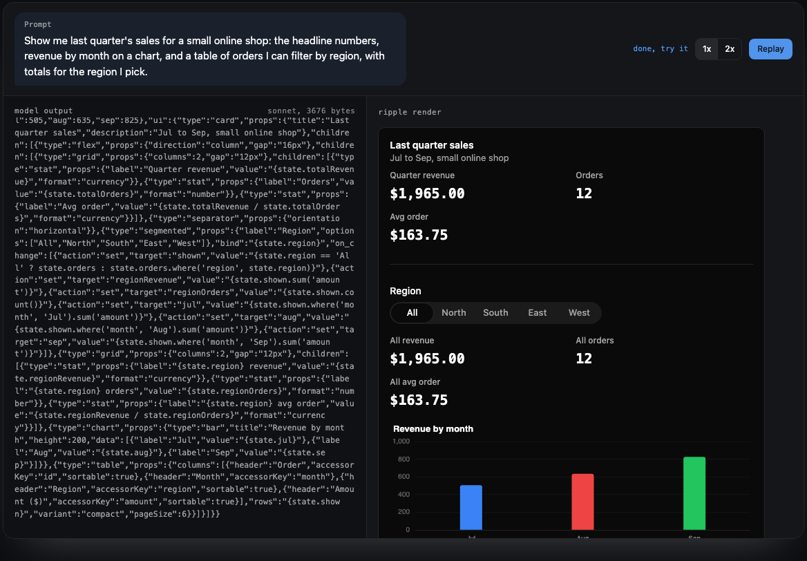

<!-- README.md: Ripple's front page. Pitch, install and a streaming example first; the package split and repo workflow below. -->

# Ripple

Open-source generative UI for your own app. A model writes a small JSON spec,
and Ripple renders it as a working interface while the spec is still
streaming in.

The finished UI is live. It keeps state, binds inputs both ways, evaluates
expressions, runs event handlers, and hands side effects (API calls,
navigation, toasts) back to your app. The model writes structure; Ripple
handles the reactivity.

[](https://ripple.pocketpaw.xyz/live)

Watch nine recorded model runs render at
[ripple.pocketpaw.xyz/live](https://ripple.pocketpaw.xyz/live), or write a
spec yourself in the [playground](https://ripple.pocketpaw.xyz/playground).

## Quick start

```bash
bun add @ripple-ui/svelte
```

```svelte
<script>
  import { Ripple } from '@ripple-ui/svelte';
  import { streamSpec } from '@ripple-ui/svelte/streaming';

  let store = $state.raw(null);

  async function generate() {
    const res = await fetch('/api/ui', { method: 'POST' }); // your endpoint, streaming the model's JSON
    store = streamSpec(res.body);
  }
</script>

<button onclick={generate}>Generate</button>
{#if store}<Ripple streaming={store} onEvent={(e) => console.log(e.type)} />{/if}
```

Ripple shows a skeleton until the first chunk parses, then grows the UI as
more tokens arrive. `onEvent` gets every side effect the spec asks your app
to perform. [`docs/streaming.md`](docs/streaming.md) covers the options and
error handling.

Widgets use Tailwind CSS v4 classes, so your app needs Tailwind v4 and an
`@source` line that points at the package. The
[Styling section](packages/svelte/README.md#styling) of the Svelte README has
the setup.

## What a spec looks like

```json
{
  "version": "1.0",
  "state": { "name": "" },
  "ui": {
    "type": "flex",
    "props": { "direction": "column", "gap": "12px" },
    "children": [
      { "type": "input", "bind": "name", "props": { "label": "Your name" } },
      { "type": "text", "props": { "text": "Hello, {state.name}!" } }
    ]
  }
}
```

That spec is a working form with two-way binding. You write no glue code for it.

## Packages

| Package | What it is |
|---|---|
| [`@ripple-ui/core`](packages/core) | The engine: schema, expressions, state, events, motion compilation, and a headless runtime that resolves a spec into a plain tree. **No framework dependency.** |
| [`@ripple-ui/svelte`](packages/svelte) | The Svelte 5 renderer: 197 widgets, the visual editor, streaming, intents. Depends on core. |

Most people installing Ripple to build a UI want `@ripple-ui/svelte`; core
comes with it. Reach for core directly when you want the engine without a
renderer — resolving specs on a server, testing them without a DOM, or
building a renderer for another framework.

## The split, and why it's shaped this way

Almost all of Ripple was never Svelte-specific. State, expression
resolution, and the event dispatcher are plain TypeScript classes. What
needed a browser was the tree *walk* — deciding which nodes render, with
what props — and only because it lived inside a Svelte component.

Pulling that walk out left a genuine engine/renderer boundary, so the
packages fall on it:

```
@ripple-ui/core            @ripple-ui/svelte
  schema                     widgets (197)
  expressions                components
  state (StateStore)         Ripple.svelte
  event dispatcher           editor, intents, streaming
  motion compiler            rune StateManager
  headless runtime           motion player (a Svelte action)
```

Three things cross the boundary by injection rather than import, because the
engine must never reach into a renderer:

- **The widget catalog.** `validateCatalog` takes its widget types as an
  argument; the Svelte package binds its own registry.
- **The motion player.** Playing an animation needs a DOM node, so
  `Ripple.svelte` passes a player into the dispatcher.
- **The state store.** Both packages implement `StateStore`. The engine
  depends on the interface, never on either class, which is what lets the
  headless runtime accept the rune-based store from a Svelte host.

The boundary is enforced, not documented: a purity test crawls the
transitive import graph from core's entry point and fails the build on any
framework import or top-level DOM access.

## Working in this repo

```bash
bun install          # links the workspace
bun run build        # builds every package
bun run check        # type-checks every package
bun run test         # tests every package
bun run dev          # the Svelte playground
```

Per-package: `cd packages/core && bun run test`.

## Docs

[`docs/`](docs) covers specs, expressions, state, events, widgets, theming,
and the headless runtime. Start at [`docs/README.md`](docs/README.md).

## License

MIT
